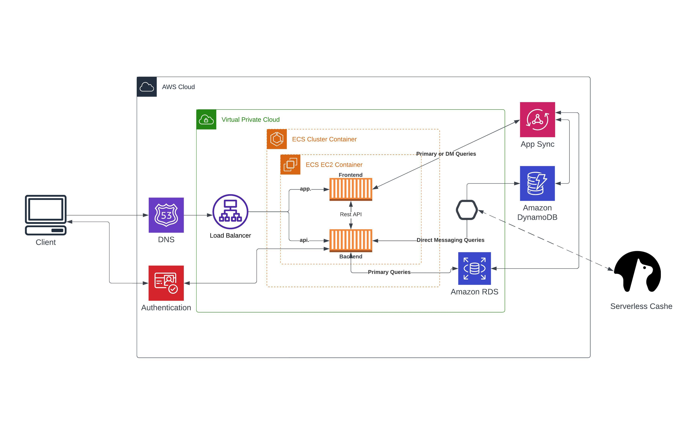

# Week 0 — Billing and Architecture

## Homework

1- I created new AWS & Lucid & Gitpod Accounts. 
2- I created the Cruddur logical chart via Lucidchart <a href="https://lucid.app/lucidchart/924f5c79-83a3-4253-aeed-34497a7b5705/edit?viewport_loc=-430%2C126%2C2220%2C1046%2C0_0&invitationId=inv_b3207a3d-bbf2-4773-8312-9d7306505d1d">link</a> 
 

3- I generate AWS Zero-Spend Budget & Monthly Cost Budget if it exceed 1$. 
4- I created an admin group then I creadted adminstrator user via IAM. 
5- install AWS CLI on gitpod via this code 
