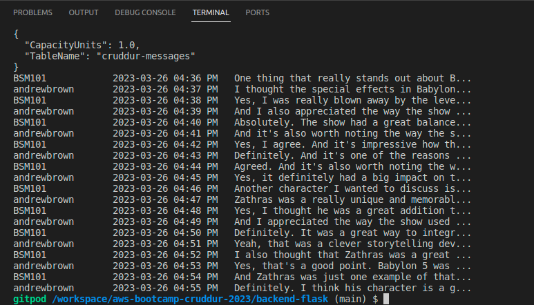
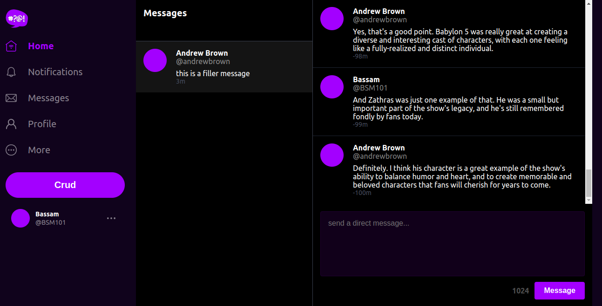
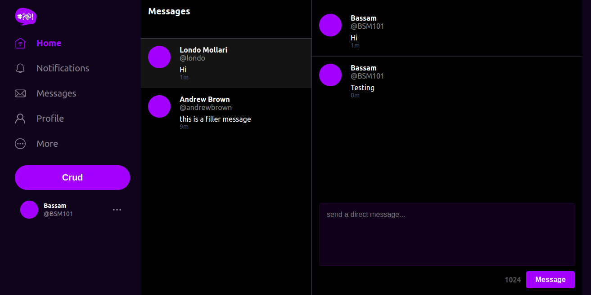
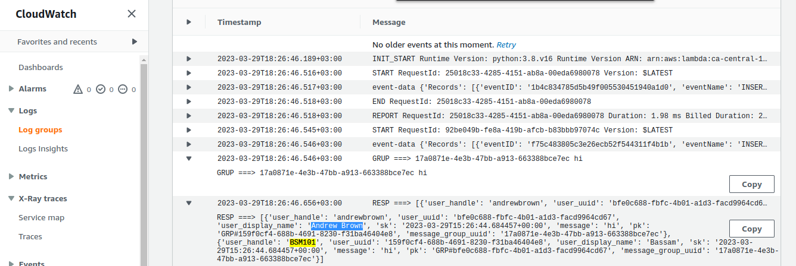

# Week 5 — DynamoDB and Serverless Caching

## DynamoDB Bash Scripts

### schema-load

First we add boto3 to `backend-flask/requirements.txt`

```sh
pip install -r requirements.txt
```

The `backend-flask/bin/ddb/schema-load` operation adds a new table to our local db using the docs below: <br>

https://boto3.amazonaws.com/v1/documentation/api/latest/reference/services/dynamodb/client/create_table.html

```.py
#!/usr/bin/env python3

import boto3
import sys

attrs = {
  'endpoint_url': 'http://localhost:8000'
}

if len(sys.argv) == 2:
  if "prod" in sys.argv[1]:
    attrs = {}

ddb = boto3.client('dynamodb',**attrs)

table_name = 'cruddur-message'


response = ddb.create_table(
  TableName=table_name,
  AttributeDefinitions=[
    {
      'AttributeName': 'pk',
      'AttributeType': 'S'
    },
    {
      'AttributeName': 'sk',
      'AttributeType': 'S'
    },
  ],
  KeySchema=[
    {
      'AttributeName': 'pk',
      'KeyType': 'HASH'
    },
    {
      'AttributeName': 'sk',
      'KeyType': 'RANGE'
    },
  ],
  #GlobalSecondaryIndexes=[
  #],
  BillingMode='PROVISIONED',
  ProvisionedThroughput={
      'ReadCapacityUnits': 5,
      'WriteCapacityUnits': 5
  }
)

print(response)
```
> we make the file executable: chmod u+x bin/ddb/schema-load

### list-tables

The `backend-flask/bin/ddb/list-tables` returns an array of table names associated with the current account and endpoint.<br>

https://docs.aws.amazon.com/cli/latest/reference/dynamodb/list-tables.html#examples

```.py
#! /usr/bin/bash
set -e # stop if it fails at any point

if [ "$1" = "prod" ]; then
  ENDPOINT_URL=""
else
  ENDPOINT_URL="--endpoint-url=http://localhost:8000"
fi

aws dynamodb list-tables $ENDPOINT_URL \
--query TableNames \
--output table
```
> we make the file executable: chmod u+x bin/ddb/list-tables

### drop table

The `backend-flask/bin/ddb/drop` operation deletes a table and all of its items.<br>

https://docs.aws.amazon.com/cli/latest/reference/dynamodb/delete-table.html#examples

```.py
#! /usr/bin/bash

set -e # stop if it fails at any point

if [ -z "$1" ]; then
  echo "No TABLE_NAME argument supplied"
  exit 1
fi
TABLE_NAME=$1

if [ "$2" = "prod" ]; then
  ENDPOINT_URL=""
else
  ENDPOINT_URL="--endpoint-url=http://localhost:8000"
fi

echo "deleting table: $TABLE_NAME"

aws dynamodb delete-table $ENDPOINT_URL \
  --table-name $TABLE_NAME
```
> we make the file executable: chmod u+x bin/ddb/drop

# seed data

we fill the data into the table `backend-flask/bin/ddb/seed`

<br>


## Pattern A  (showing a single conversation)

A user wants to see a list of messages that belong to a message group
The messages must be ordered by the created_at timestamp from newest to oldest (DESC)

```sql
SELECT
  messages.uuid,
  messages.display_name,
  messages.message,
  messages.handle,
  messages.created_at -- sk
FROM messages
WHERE
  messages.message_group_uuid = {{message_group_uuid}} -- pk
ORDER BY messages.created_at DESC
```

> message_group_uuid comes from Pattern B


## Pattern B (list of conversation)

A user wants to see a list of previous conversations.
These conversations are listed from newest to oldest (DESC)
We want to see the other person we are talking to.
We want to see the last message (from whomever) in summary.

```sql
SELECT
  message_groups.uuid,
  message_groups.other_user_uuid,
  message_groups.other_user_display_name,
  message_groups.other_user_handle,
  message_groups.last_message,
  message_groups.last_message_at
FROM message_groups
WHERE
  message_groups.user_uuid = {{user_uuid}} --pk
ORDER BY message_groups.last_message_at DESC
```
> We need a Global Secondary Index (GSI)

<br>

## Pattern C (create a message)

```sql
INSERT INTO messages (
  user_uuid,
  display_name,
  handle,
  creaed_at
)
VALUES (
  {{user_uuid}},
  {{display_name}},
  {{handle}},
  {{created_at}}
);
```

<br>

## Pattern D (update a message_group for the last message)

When a user creates a message we need to update the conversation
to display the last message information for the conversation

```sql
UPDATE message_groups
SET 
  other_user_uuid = {{other_user_uuid}}
  other_user_display_name = {{other_user_display_name}}
  other_user_handle = {{other_user_handle}}
  last_message = {{last_message}}
  last_message_at = {{last_message_at}}
WHERE 
  message_groups.uuid = {{message_group_uuid}}
  AND message_groups.user_uuid = {{user_uuid}}
```

### DynamoDB Stream trigger to update message groups

- create a VPC endpoint for dynamoDB service on your VPC
- create a Python lambda function in your vpc
- enable streams on the table with 'new image' attributes included
- add your function as a trigger on the stream
- grant the lambda IAM role permission to read the DynamoDB stream events

`AWSLambdaInvocation-DynamoDB`

- grant the lambda IAM role permission to update table items


**The Function**

```.py
import json
import boto3
from boto3.dynamodb.conditions import Key, Attr

dynamodb = boto3.resource(
 'dynamodb',
 region_name='ca-central-1',
 endpoint_url="http://dynamodb.ca-central-1.amazonaws.com"
)

def lambda_handler(event, context):
  print('event-data',event)

  eventName = event['Records'][0]['eventName']
  if (eventName == 'REMOVE'):
    print("skip REMOVE event")
    return
  pk = event['Records'][0]['dynamodb']['Keys']['pk']['S']
  sk = event['Records'][0]['dynamodb']['Keys']['sk']['S']
  if pk.startswith('MSG#'):
    group_uuid = pk.replace("MSG#","")
    message = event['Records'][0]['dynamodb']['NewImage']['message']['S']
    print("GRUP ===>",group_uuid,message)

    table_name = 'cruddur-messages'
    index_name = 'message-group-sk-index'
    table = dynamodb.Table(table_name)
    data = table.query(
      IndexName=index_name,
      KeyConditionExpression=Key('message_group_uuid').eq(group_uuid)
    )
    print("RESP ===>",data['Items'])

    # recreate the message group rows with new SK value
    for i in data['Items']:
      delete_item = table.delete_item(Key={'pk': i['pk'], 'sk': i['sk']})
      print("DELETE ===>",delete_item)

      response = table.put_item(
        Item={
          'pk': i['pk'],
          'sk': sk,
          'message_group_uuid':i['message_group_uuid'],
          'message':message,
          'user_display_name': i['user_display_name'],
          'user_handle': i['user_handle'],
          'user_uuid': i['user_uuid']
        }
      )
      print("CREATE ===>",response)
```

<br>
