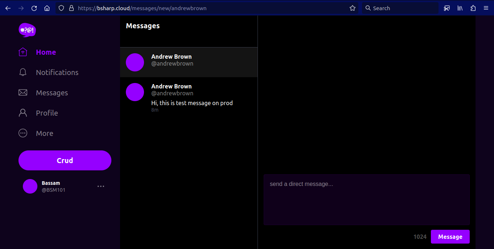

# Week 6 — Deploying Containers

## Test RDS Connecetion

We add `backend-flask/bin/db/test` script so we can easily check our connection from our container.

```sh
#!/usr/bin/env python3

import psycopg
import os
import sys

connection_url = os.getenv("CONNECTION_URL")

conn = None
try:
  print('attempting connection')
  conn = psycopg.connect(connection_url)
  print("Connection successful!")
except psycopg.Error as e:
  print("Unable to connect to the database:", e)
finally:
  conn.close()
```
> chmod u+x bin/db/test

## Task Flask Script

We'll create a new bin script at `backend-flask/bin/flask/health-check`

```py
#!/usr/bin/env python3

import urllib.request

try:
  response = urllib.request.urlopen('http://localhost:4567/api/health-check')
  if response.getcode() == 200:
    print("[OK] Flask server is running")
    exit(0) # success
  else:
    print("[BAD] Flask server is not running")
    exit(1) # false

except Exception as e:
  print(e)
  exit(1) # false
```
> chmod u+x bin/flask/health-check


We'll add the following endpoint for our flask app`backend-flask/app.py`

```py
@app.route('/api/health-check')
def health_check():
  return {'success': True}, 200
```
## Create CloudWatch Log Group

```sh
aws logs create-log-group --log-group-name cruddur
aws logs put-retention-policy --log-group-name cruddur --retention-in-days 1
```

## Create ECS Cluster

```sh
aws ecs create-cluster \
--cluster-name cruddur \
--service-connect-defaults namespace=cruddur
```


## Create ECR repo and push image

### For Base-image python

```sh
aws ecr create-repository \
  --repository-name cruddur-python \
  --image-tag-mutability MUTABLE
```

### Login to ECR

```sh
aws ecr get-login-password --region $AWS_DEFAULT_REGION | docker login --username AWS --password-stdin "$AWS_ACCOUNT_ID.dkr.ecr.$AWS_DEFAULT_REGION.amazonaws.com"
```

#### Set URL

```sh
export ECR_PYTHON_URL="$AWS_ACCOUNT_ID.dkr.ecr.$AWS_DEFAULT_REGION.amazonaws.com/cruddur-python"
echo $ECR_PYTHON_URL
```

#### Pull Image

```sh
docker pull python:3.10-slim-buster
```

#### Tag Image

```sh
docker tag python:3.10-slim-buster $ECR_PYTHON_URL:3.10-slim-buster
```

#### Push Image

```sh
docker push $ECR_PYTHON_URL:3.10-slim-buster
```

update `backend-flask/Dockerfile`

### For Flask

#### Create Repo
```sh
aws ecr create-repository \
  --repository-name backend-flask \
  --image-tag-mutability MUTABLE
```

#### Set URL

```sh
export ECR_BACKEND_FLASK_URL="$AWS_ACCOUNT_ID.dkr.ecr.$AWS_DEFAULT_REGION.amazonaws.com/backend-flask"
echo $ECR_BACKEND_FLASK_URL
```


#### Build Image
cd `backend-flask/`

```sh
docker build -t backend-flask .
```
#### Tag Image

```sh
docker tag backend-flask:latest $ECR_BACKEND_FLASK_URL:latest
```

#### Push Image

```sh
docker push $ECR_BACKEND_FLASK_URL:latest
```

## Register Task Defintions

### Passing Senstive Data to Task Defintion

https://docs.aws.amazon.com/AmazonECS/latest/developerguide/specifying-sensitive-data.html
https://docs.aws.amazon.com/AmazonECS/latest/developerguide/secrets-envvar-ssm-paramstore.html

```sh
aws ssm put-parameter --type "SecureString" --name "/cruddur/backend-flask/AWS_ACCESS_KEY_ID" --value $AWS_ACCESS_KEY_ID
aws ssm put-parameter --type "SecureString" --name "/cruddur/backend-flask/AWS_SECRET_ACCESS_KEY" --value $AWS_SECRET_ACCESS_KEY
aws ssm put-parameter --type "SecureString" --name "/cruddur/backend-flask/CONNECTION_URL" --value $PROD_CONNECTION_URL
aws ssm put-parameter --type "SecureString" --name "/cruddur/backend-flask/ROLLBAR_ACCESS_TOKEN" --value $ROLLBAR_ACCESS_TOKEN
aws ssm put-parameter --type "SecureString" --name "/cruddur/backend-flask/OTEL_EXPORTER_OTLP_HEADERS" --value "x-honeycomb-team=$HONEYCOMB_API_KEY"
```


### Create Task and Exection Roles for Task Defintion

We add`aws/policies/service-assume-role-execution-policy.json`:

```json
{
  "Version": "2012-10-17",
  "Statement": [
    {
      "Sid": "",
      "Action": "sts:AssumeRole",
      "Effect": "Allow",
      "Principal": {
        "Service": ["ecs-tasks.amazonaws.com"]
      }
    }
  ]
}
```
Then we run:

```sh
aws iam create-role \
--role-name CruddurServiceExecutionRole  \
--assume-role-policy-document "file://aws/policies/service-assume-role-execution-policy.json"
```

We add `aws/policies/service-execution-policy.json`"

```json
{
  "Version":"2012-10-17",
  "Statement":[{
    "Sid": "VisualEditor0",
    "Effect": "Allow",
    "Action": [
      "ssm:GetParameters",
      "ssm:GetParameter"],
    "Resource": "arn:aws:ssm:ca-central-1:354592008288:parameter/cruddur/backend-flask/*"
  },{
    "Sid": "VisualEditor1",
    "Effect": "Allow",
    "Action": [
        "ecr:GetAuthorizationToken",
        "ecr:BatchCheckLayerAvailability",
        "ecr:GetDownloadUrlForLayer",
        "ecr:BatchGetImage",
        "logs:CreateLogStream",
        "logs:PutLogEvents"
      ],
    "Resource": "*"
  }]
}
```

Then we run:

```sh
aws iam put-role-policy \
  --policy-name CruddurServiceExecutionPolicy \
  --role-name CruddurServiceExecutionRole \
  --policy-document "file://aws/policies/service-execution-policy.json"
```

#### Create TaskRole

```sh
aws iam create-role \
    --role-name CruddurTaskRole \
    --assume-role-policy-document "{
  \"Version\":\"2012-10-17\",
  \"Statement\":[{
    \"Action\":[\"sts:AssumeRole\"],
    \"Effect\":\"Allow\",
    \"Principal\":{
      \"Service\":[\"ecs-tasks.amazonaws.com\"]
    }
  }]
}"
```
```sh
aws iam put-role-policy \
  --policy-name SSMAccessPolicy \
  --role-name CruddurTaskRole \
  --policy-document "{
  \"Version\":\"2012-10-17\",
  \"Statement\":[{
    \"Action\":[
      \"ssmmessages:CreateControlChannel\",
      \"ssmmessages:CreateDataChannel\",
      \"ssmmessages:OpenControlChannel\",
      \"ssmmessages:OpenDataChannel\"
    ],
    \"Effect\":\"Allow\",
    \"Resource\":\"*\"
  }]
}"
```
```sh
aws iam attach-role-policy --policy-arn arn:aws:iam::aws:policy/CloudWatchFullAccess --role-name CruddurTaskRole
aws iam attach-role-policy --policy-arn arn:aws:iam::aws:policy/AWSXRayDaemonWriteAccess --role-name CruddurTaskRole
```


### Create Task

We add `aws/task-definitions/backend-flask.json`:

```json
{
  "family": "backend-flask",
  "executionRoleArn": "arn:aws:iam::354592008288:role/CruddurServiceExecutionRole",
  "taskRoleArn": "arn:aws:iam::354592008288:role/CruddurTaskRole",
  "networkMode": "awsvpc",
  "cpu": "256",
  "memory": "512",
  "requiresCompatibilities": [ 
    "FARGATE" 
  ],
  "containerDefinitions": [
    {
      "name": "backend-flask",
      "image": "354592008288.dkr.ecr.ca-central-1.amazonaws.com/backend-flask",
      "essential": true,
      "healthCheck": {
        "command": [
          "CMD-SHELL",
          "python /backend-flask/bin/flask/health-check"
        ],
        "interval": 30,
        "timeout": 5,
        "retries": 3,
        "startPeriod": 60
      },
      "portMappings": [
        {
          "name": "backend-flask",
          "containerPort": 4567,
          "protocol": "tcp", 
          "appProtocol": "http"
        }
      ],
      "logConfiguration": {
        "logDriver": "awslogs",
        "options": {
            "awslogs-group": "cruddur",
            "awslogs-region": "ca-central-1",
            "awslogs-stream-prefix": "backend-flask"
        }
      },
      "environment": [
        {"name": "OTEL_SERVICE_NAME", "value": "backend-flask"},
        {"name": "OTEL_EXPORTER_OTLP_ENDPOINT", "value": "https://api.honeycomb.io"},
        {"name": "AWS_COGNITO_USER_POOL_ID", "value": "ca-central-1_UsjN952Tg"},
        {"name": "AWS_COGNITO_USER_POOL_CLIENT_ID", "value": "3677vra83pplne8l2jcemaougj"},
        {"name": "FRONTEND_URL", "value": "*"},
        {"name": "BACKEND_URL", "value": "*"},
        {"name": "AWS_DEFAULT_REGION", "value": "ca-central-1"}
      ],
      "secrets": [
        {"name": "AWS_ACCESS_KEY_ID"    , "valueFrom": "arn:aws:ssm:ca-central-1:354592008288:parameter/cruddur/backend-flask/AWS_ACCESS_KEY_ID"},
        {"name": "AWS_SECRET_ACCESS_KEY", "valueFrom": "arn:aws:ssm:ca-central-1:354592008288:parameter/cruddur/backend-flask/AWS_SECRET_ACCESS_KEY"},
        {"name": "CONNECTION_URL"       , "valueFrom": "arn:aws:ssm:ca-central-1:354592008288:parameter/cruddur/backend-flask/CONNECTION_URL" },
        {"name": "ROLLBAR_ACCESS_TOKEN" , "valueFrom": "arn:aws:ssm:ca-central-1:354592008288:parameter/cruddur/backend-flask/ROLLBAR_ACCESS_TOKEN" },
        {"name": "OTEL_EXPORTER_OTLP_HEADERS" , "valueFrom": "arn:aws:ssm:ca-central-1:354592008288:parameter/cruddur/backend-flask/OTEL_EXPORTER_OTLP_HEADERS" }
      ]
    }
  ]
}
```

### Register Task Defintion

```sh
aws ecs register-task-definition --cli-input-json file://aws/task-definitions/backend-flask.json
```

## Default SG for VPC

```sh
export DEFAULT_VPC_ID=$(aws ec2 describe-vpcs \
--filters "Name=isDefault, Values=true" \
--query "Vpcs[0].VpcId" \
--output text)
echo $DEFAULT_VPC_ID
```

```sh
export DEFAULT_SUBNET_IDS=$(aws ec2 describe-subnets  \
 --filters Name=vpc-id,Values=$DEFAULT_VPC_ID \
 --query 'Subnets[*].SubnetId' \
 --output json | jq -r 'join(",")')
echo $DEFAULT_SUBNET_IDS
```

### Create Security Group


```sh
export CRUD_SERVICE_SG=$(aws ec2 create-security-group \
  --group-name "crud-srv-sg" \
  --description "Security group for Cruddur services on ECS" \
  --vpc-id $DEFAULT_VPC_ID \
  --query "GroupId" --output text)
echo $CRUD_SERVICE_SG
```

```sh
aws ec2 authorize-security-group-ingress \
  --group-id $CRUD_SERVICE_SG \
  --protocol tcp \
  --port 80 \
  --cidr 0.0.0.0/0
```

### Create Services

we add `aws/json/service-backend-flask.json`:

```json
{
  "cluster": "cruddur",
  "launchType": "FARGATE",
  "desiredCount": 1,
  "enableECSManagedTags": true,
  "enableExecuteCommand": true,
  "loadBalancers": [
    {
        "targetGroupArn": "arn:aws:elasticloadbalancing:ca-central-1:354592008288:targetgroup/cruddur-backend-flask-tg/2dbd92465b0316dd",
        "containerName": "backend-flask",
        "containerPort": 4567
    }
  ],
  "networkConfiguration": {
    "awsvpcConfiguration": {
      "assignPublicIp": "ENABLED",
      "securityGroups": [
        "sg-0470bc037a013789e"
      ],
      "subnets": [
        "subnet-0fe152ea6bc433b2d", 
        "subnet-0e22fdf2c4656c061",
        "subnet-00fbadd7a4e7fc83e"
      ]
    }
  },
  "serviceConnectConfiguration": {
    "enabled": true,
    "namespace": "cruddur",
    "services": [
      {
        "portName": "backend-flask",
        "discoveryName": "backend-flask",
        "clientAliases": [{"port": 4567}]
      }
    ]
  },
  "propagateTags": "SERVICE",
  "serviceName": "backend-flask",
  "taskDefinition": "backend-flask"
}
```

```sh
aws ecs create-service --cli-input-json file://aws/json/service-backend-flask.json
```

<br>

we add `backend-flask/bin/ecs/connect-to-service`:

```sh
#! /usr/bin/bash
if [ -z "$1" ]; then
  echo "No TASK_ID argument supplied eg ./bin/ecs/connect-to-service TASK_ID CONTAINER_NAME"
  exit 1
fi
TASK_ID=$1

if [ -z "$2" ]; then
  echo "No CONTAINER_NAME argument supplied eg ./bin/ecs/connect-to-service TASK_ID CONTAINER_NAME"
  exit 1
fi
CONTAINER_NAME=$2

aws ecs execute-command  \
--region $AWS_DEFAULT_REGION \
--cluster cruddur \
--task $TASK_ID \
--container $CONTAINER_NAME \
--command "/bin/bash" \
--interactive
```
> chmod u+x bin/ecs/connect-to-service

To get TASK_ID & CONTAINER_NAME we run the command:

```sh
aws ecs list-tasks --cluster cruddur
```

<br>

### Test Flask App is running

<br>

# For Frontend React

ECS Frontend service  `aws/task-definitions/frontend-react-js.json`:

```json
{
  "family": "frontend-react-js",
  "executionRoleArn": "arn:aws:iam::354592008288:role/CruddurServiceExecutionRole",
  "taskRoleArn": "arn:aws:iam::354592008288:role/CruddurTaskRole",
  "networkMode": "awsvpc",
  "cpu": "256",
  "memory": "512",
  "requiresCompatibilities": [ 
    "FARGATE" 
  ],
  "containerDefinitions": [
    {
      "name": "frontend-react-js",
      "image": "354592008288.dkr.ecr.ca-central-1.amazonaws.com/frontend-react-js",
      "essential": true,
      "portMappings": [
        {
          "name": "frontend-react-js",
          "containerPort": 3000,
          "protocol": "tcp", 
          "appProtocol": "http"
        }
      ],

      "logConfiguration": {
        "logDriver": "awslogs",
        "options": {
            "awslogs-group": "cruddur",
            "awslogs-region": "ca-central-1",
            "awslogs-stream-prefix": "frontend-react-js"
        }
      }
    }
  ]
}
```

We create `frontend-react-js/Dockerfile.prod`:

```sh
# Base Image ~~~~~~~~~~~~~~~~~~~~~~~~~~~~~~~~~~
FROM node:16.18 AS build

ARG REACT_APP_BACKEND_URL
ARG REACT_APP_AWS_PROJECT_REGION
ARG REACT_APP_AWS_COGNITO_REGION
ARG REACT_APP_AWS_USER_POOLS_ID
ARG REACT_APP_CLIENT_ID

ENV REACT_APP_BACKEND_URL=$REACT_APP_BACKEND_URL
ENV REACT_APP_AWS_PROJECT_REGION=$REACT_APP_AWS_PROJECT_REGION
ENV REACT_APP_AWS_COGNITO_REGION=$REACT_APP_AWS_COGNITO_REGION
ENV REACT_APP_AWS_USER_POOLS_ID=$REACT_APP_AWS_USER_POOLS_ID
ENV REACT_APP_CLIENT_ID=$REACT_APP_CLIENT_ID

COPY . ./frontend-react-js
WORKDIR /frontend-react-js
RUN npm install
RUN npm run build

# New Base Image ~~~~~~~~~~~~~~~~~~~~~~~~~~~~~~
FROM nginx:1.23.3-alpine

# --from build is coming from the Base Image
COPY --from=build /frontend-react-js/build /usr/share/nginx/html
COPY --from=build /frontend-react-js/nginx.conf /etc/nginx/nginx.conf

EXPOSE 3000
```

we run:

```sh
npm run build
```

#### Build Image

```sh
docker build \
--build-arg REACT_APP_BACKEND_URL="cruddur-alb-1393309236.ca-central-1.elb.amazonaws.com:4567" \
--build-arg REACT_APP_AWS_PROJECT_REGION="$AWS_DEFAULT_REGION" \
--build-arg REACT_APP_AWS_COGNITO_REGION="$AWS_DEFAULT_REGION" \
--build-arg REACT_APP_AWS_USER_POOLS_ID="ca-central-1_UsjN952Tg" \
--build-arg REACT_APP_CLIENT_ID="3677vra83pplne8l2jcemaougj" \
-t frontend-react-js \
-f Dockerfile.prod \
.
```
#### Create Repo
```sh
aws ecr create-repository \
  --repository-name frontend-react-js \
  --image-tag-mutability MUTABLE
```


#### Set URL

```sh
export ECR_FRONTEND_REACT_URL="$AWS_ACCOUNT_ID.dkr.ecr.$AWS_DEFAULT_REGION.amazonaws.com/frontend-react-js"
echo $ECR_FRONTEND_REACT_URL
```

### Login to ECR

```sh
aws ecr get-login-password --region $AWS_DEFAULT_REGION | docker login --username AWS --password-stdin "$AWS_ACCOUNT_ID.dkr.ecr.$AWS_DEFAULT_REGION.amazonaws.com"
```

#### Tag Image

```sh
docker tag frontend-react-js:latest $ECR_FRONTEND_REACT_URL:latest
```

#### Push Image

```sh
docker push $ECR_FRONTEND_REACT_URL:latest
```


#### Create Frontend Service:

We add `aws/json/service-frontend-react-js.json`

```json
{
    "cluster": "cruddur",
    "launchType": "FARGATE",
    "desiredCount": 1,
    "enableECSManagedTags": true,
    "enableExecuteCommand": true,
    "loadBalancers": [
      {
          "targetGroupArn": "arn:aws:elasticloadbalancing:ca-central-1:354592008288:targetgroup/cruddur-frontend-react-js-tg/5871faa4e8ebeb9d",
          "containerName": "frontend-react-js",
          "containerPort": 3000
      }
    ],
    "networkConfiguration": {
      "awsvpcConfiguration": {
        "assignPublicIp": "ENABLED",
        "securityGroups": [
          "sg-0470bc037a013789e"
        ],
        "subnets": [
            "subnet-0fe152ea6bc433b2d",
            "subnet-0e22fdf2c4656c061",
            "subnet-00fbadd7a4e7fc83e"
        ]
      }
    },
    "propagateTags": "SERVICE",
    "serviceName": "frontend-react-js",
    "taskDefinition": "frontend-react-js",
    "serviceConnectConfiguration": {
      "enabled": true,
      "namespace": "cruddur",
      "services": [
        {
          "portName": "frontend-react-js",
          "discoveryName": "frontend-react-js",
          "clientAliases": [{"port": 3000}]
        }
      ]
    }
  }
```

### Register Task Defintion

```sh
aws ecs register-task-definition --cli-input-json file://aws/task-definitions/frontend-react-js.json
```
### Run frontend service

```sh
aws ecs create-service --cli-input-json file://aws/json/service-frontend-react-js.json
```
### Domain 'Prod Env'

<br>

<br>
