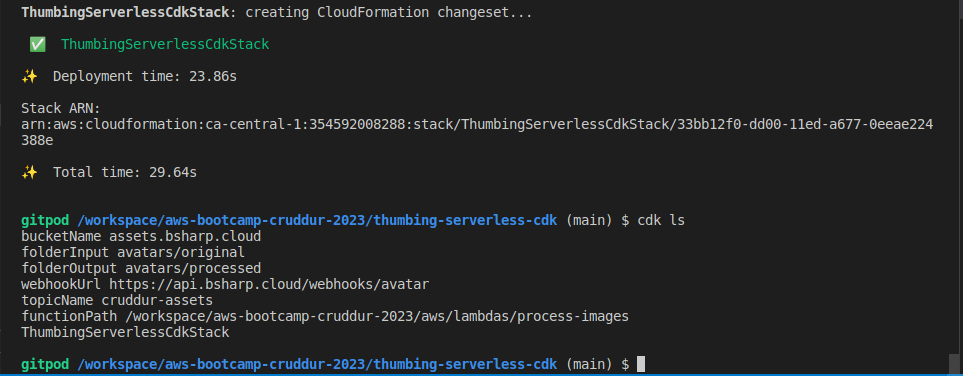

# Week 8 — Serverless Image Processing

## New Directory

Lets contain our cdk pipeline in a new top level directory called `thumbing-serverless-cdk`:

```sh
mkdir thumbing-serverless-cdk
npm install aws-cdk -g
```

## Install CDK globally

We'll add the install process to our `.gitpod.yml` task file
```sh
  - name: cdk
    before: |
      npm install aws-cdk -g
      cd thumbing-serverless-cdk
      cp .env.example .env
      npm i
```

## Initialize a new project

We'll initialize a new cdk project within the folder we created:

```sh
cd thumbing-serverless-cdk
cdk init app --language typescript
```

## Load Env Vars

we add `thumbing-serverless-cdk/.env.example` file:

```ts
THUMBING_BUCKET_NAME="assets.bsharp.cloud"
THUMBING_S3_FOLDER_INPUT="avatars/original"
THUMBING_S3_FOLDER_OUTPUT="avatars/processed"
THUMBING_WEBHOOK_URL="https://api.bsharp.cloud/webhooks/avatar"
THUMBING_TOPIC_NAME="cruddur-assets"
THUMBING_FUNCTION_PATH="/workspace/aws-bootcamp-cruddur-2023/aws/lambdas/process-images"
```

then we run
```sh
cd thumbing-serverless-cdk
cp .env.example .env
```


## install SharpJS

```sh
cd aws/lambdas/process-images
npm init -y
npm i sharp
npm i @aws-sdk/client-s3
```

## Lambda Shrap

we run `bin/avatar/build`:
```sh
#! /usr/bin/bash

ABS_PATH=$(readlink -f "$0")
SERVERLESS_PATH=$(dirname $ABS_PATH)
BIN_PATH=$(dirname $SERVERLESS_PATH)
PROJECT_PATH=$(dirname $BIN_PATH)
SERVERLESS_PROJECT_PATH="$PROJECT_PATH/thumbing-serverless-cdk"

cd $SERVERLESS_PROJECT_PATH

npm install
rm -rf node_modules/sharp
SHARP_IGNORE_GLOBAL_LIBVIPS=1 npm install --arch=x64 --platform=linux --libc=glibc sharp
```
> chmod u+x bin/avatar/build


## Add an S3 Bucket


We create `assets.bsharp.cloud` s3 bucket manually:

```ts
import * as s3 from 'aws-cdk-lib/aws-s3';

const bucket = this.createBucket(bucketName)

createBucket(bucketName: string): s3.IBucket {
  const logicalName: string = 'ThumbingBucket';
  const bucket = new s3.Bucket(this, logicalName , {
    bucketName: bucketName,
    removalPolicy: cdk.RemovalPolicy.DESTROY,
  });
  return bucket;
}
```

- [Bucket Construct](https://docs.aws.amazon.com/cdk/api/v2/docs/aws-cdk-lib.aws_s3.Bucket.html)
- [Removal Policy](https://docs.aws.amazon.com/cdk/api/v1/docs/@aws-cdk_core.RemovalPolicy.html)

## Set domain var:

```sh
export DOMAIN_NAME=bsharp.cloud
gp env DOMAIN_NAME=bsharp.cloud
```

## Bootstrapping

https://docs.aws.amazon.com/cdk/v2/guide/bootstrapping.html

Deploying stacks with the AWS CDK requires dedicated Amazon S3 buckets and other containers to be available to AWS CloudFormation during deployment. 

```sh
cdk bootstrap "aws://$AWS_ACCOUNT_ID/$AWS_DEFAULT_REGION"
```


## Build

In most programming environments, after changing our code, we build (compile) it. 
This isn't strictly necessary with the AWS CDK — the Toolkit does it for you so that you can't forget. 
But we can still build manually whenever we want to catch syntax and type errors. 

```sh
npm run build
```

## Synth

The synth command is used to synthesize the AWS CloudFormation stack(s) that represent your infrastructure as code.

```sh
cdk synth
```

## List Stacks

```sh
cdk ls
```

## Deploy

```sh
cdk deploy
```

<br>


## Upload an image

we add `bin/avatar/upload`:

```sh
#! /usr/bin/bash

ABS_PATH=$(readlink -f "$0")
SERVERLESS_PATH=$(dirname $ABS_PATH)
DATA_FILE_PATH="$SERVERLESS_PATH/files/data.jpg"

aws s3 cp "$DATA_FILE_PATH" "s3://assets.$DOMAIN_NAME/avatars/original/data.jpg"
```
> chmod u+x bin/avatar/upload

we add `bin/avatar/clear`:

```sh
#! /usr/bin/bash

ABS_PATH=$(readlink -f "$0")
SERVERLESS_PATH=$(dirname $ABS_PATH)
DATA_FILE_PATH="$SERVERLESS_PATH/files/data.jpg"

aws s3 rm "s3://assets.$DOMAIN_NAME/avatars/original/data.jpg"
aws s3 rm "s3://assets.$DOMAIN_NAME/avatars/processed/data.jpg"
```
> chmod u+x bin/avatar/clear


## Create Lambda

```ts
import * as lambda from 'aws-cdk-lib/aws-lambda';

const lambda = this.createLambda(folderInput,folderOutput,functionPath,bucketName)

createLambda(folderIntput: string, folderOutput: string, functionPath: string, bucketName: string): lambda.IFunction {
  const logicalName = 'ThumbLambda';
  const code = lambda.Code.fromAsset(functionPath)
  const lambdaFunction = new lambda.Function(this, logicalName, {
    runtime: lambda.Runtime.NODEJS_18_X,
    handler: 'index.handler',
    code: code,
    environment: {
      DEST_BUCKET_NAME: bucketName,
      FOLDER_INPUT: folderIntput,
      FOLDER_OUTPUT: folderOutput,
      PROCESS_WIDTH: '512',
      PROCESS_HEIGHT: '512'
    }
  });
  return lambdaFunction;
}
```


## Create SNS Topic

```ts
import * as sns from 'aws-cdk-lib/aws-sns';

const snsTopic = this.createSnsTopic(topicName)

createSnsTopic(topicName: string): sns.ITopic{
  const logicalName = "Topic";
  const snsTopic = new sns.Topic(this, logicalName, {
    topicName: topicName
  });
  return snsTopic;
}
```

## Create an SNS Subscription

```ts
import * as s3n from 'aws-cdk-lib/aws-s3-notifications';

this.createSnsSubscription(snsTopic,webhookUrl)

createSnsSubscription(snsTopic: sns.ITopic, webhookUrl: string): sns.Subscription {
  const snsSubscription = snsTopic.addSubscription(
    new subscriptions.UrlSubscription(webhookUrl)
  )
  return snsSubscription;
}
```

## Create S3 Event Notification to SNS

```ts
this.createS3NotifyToSns(folderOutput,snsTopic,bucket)

createS3NotifyToSns(prefix: string, snsTopic: sns.ITopic, bucket: s3.IBucket): void {
  const destination = new s3n.SnsDestination(snsTopic)
  bucket.addEventNotification(
    s3.EventType.OBJECT_CREATED_PUT, 
    destination,
    {prefix: prefix}
  );
}
```

## Create S3 Event Notification to Lambda

```ts
this.createS3NotifyToLambda(folderInput,laombda,bucket)

createS3NotifyToLambda(prefix: string, lambda: lambda.IFunction, bucket: s3.IBucket): void {
  const destination = new s3n.LambdaDestination(lambda);
    bucket.addEventNotification(s3.EventType.OBJECT_CREATED_PUT,
    destination,
    {prefix: prefix}
  )
}
```

## Create Policy for Bucket Access

```ts
const s3ReadWritePolicy = this.createPolicyBucketAccess(bucket.bucketArn)
```

## Create Policy for SNS Publishing

```ts
const snsPublishPolicy = this.createPolicySnSPublish(snsTopic.topicArn)
```

## Attach the Policies to the Lambda Role

```ts
lambda.addToRolePolicy(s3ReadWritePolicy);
lambda.addToRolePolicy(snsPublishPolicy);
```